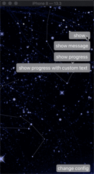

# TIMProgressHUD

[](https://travis-ci.org/Tim/TIMProgressHUD)
[](https://cocoapods.org/pods/TIMProgressHUD)
[](https://cocoapods.org/pods/TIMProgressHUD)
[](https://cocoapods.org/pods/TIMProgressHUD)

## Preface - 写在前面

This project refers to [Harley-xk](https://github.com/Harley-xk) 's [Chrysan](https://github.com/Harley-xk/Chrysan).

本项目参考了[Harley-xk](https://github.com/Harley-xk) 的 [Chrysan](https://github.com/Harley-xk/Chrysan). 原作者项目中采用了 Objective-C 的添加关联对象的方式动态将控件添加到 View 以及 ViewController 中，个人觉得不太 Swift。所以产生了本项目，我的思路是使用 RxSwift 的添加前缀的方式通过泛型将控件添加到 View 以及 ViewController 中。具体步骤可以参考 Demo。

## Example - 代码示例

运行demo可以得到以下效果

    

## Requirements - 必要条件

- Xcode 10.0 ~>
- Swift 5.0 ~>

## Installation - 导入方式

-  [Cocoapods](https://cocoapods.org) - 使用  [Cocoapods](https://cocoapods.org) 导入方法：

  TIMProgressHUD 可以通过 [Cocoapods](https://cocoapods.org) 进行导入，也可以通过源代码进行导入，在你项目中的 Podfile 中添加以下代码：

  TIMProgressHUD is available through [CocoaPods](https://cocoapods.org). To install it, simply add the following line to your Podfile:

  ```ruby
  # 如果是 Cocoapods 1.8.0 版本或以上的用户请添加 CocoaPods 源在你的 Podfile 文件最顶部添加
  source 'https://github.com/CocoaPods/Specs.git'		# 添加这一句，不然会报 cdn 错误
  target 'xxx' do
  	pod 'TIMProgressHUD'
  end
  ```

  打开命令行工具，进入到 Podfile 所在文件夹，执行 `pod install` 或  `pod update` 

  Open Terminal;

  Go to the directory where Podfile is located;

  Execute `pod install` or  `pod update`.

- Source code - 源代码导入

  Download the TIMProgressHUD via zip;

  通过 zip 的方式下载源代码；

  Drag the TIMProgressHUD folder into your project (Don't forget tick the checkbox that copy item if needed);

  拖拽 TIMProgressHUD 文件夹到你的项目中（不要忘记勾选 copy item if needed 复选框）；

## Useg - 使用方式

- If you installed TIMProgressHUD via [Cocoapods](https://cocoapods.org) , where you need it `import TIMProgressHUD` . Use the following statement to call up the control.

- 如果你通过 [Cocoapods](https://cocoapods.org) 导入本项目，在你需要的地方或者项目的全局父类中 `import TIMProgressHUD`。使用以下语句吊起控件。

- If you installed TIMProgressHUD via source code,  Use the following statement to call up the control.

- 如果你通过源代码的方式安装本项目，可以直接使用下面的语句吊起控件。

  ```Swift
  tm.progressHUD.show()
  ```

## Author - 作者

Tim, guoyong19890907@gmail.com

## License

TIMProgressHUD is available under the MIT license. See the LICENSE file for more info.
